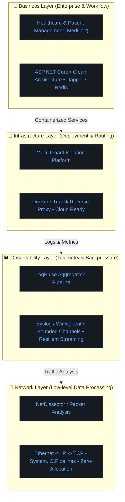

# Hi, I'm Dmitry Karpenko 👋
### Senior .NET Developer & Systems Engineer

I am a backend and systems-oriented engineer focused on building high-performance data processing pipelines, network protocol analyzers, and infrastructure-level applications. 

I approach architecture from a systems perspective: focusing on data flow, memory efficiency (zero-allocation), and robust deployment models, bridging the gap between enterprise logic, cloud infrastructure, and hardware telemetry.

---

### 🧠 Core Engineering Philosophy
> **Ingestion → Processing (Backpressure) → Normalization → Output**
> *Designing systems that handle real-world telemetry and network streams reliably.*

---

### 🏗️ My Engineering Ecosystem

This is the architectural layered model I use to build and scale systems, from low-level network packets to high-level enterprise workflows.

### 🚀 Technical Arsenal
* **Backend & Architecture**: .NET, C#, Clean Architecture, REST APIs, Dapper

* **Systems & Performance**: `System.IO.Pipelines`, Bounded Channels (Backpressure), `ReadOnlySpan`, Zero-Allocation Parsing

* **Networking**: Packet Analysis (Ethernet/IP/TCP), NetFlow v9, MikroTik Routing, Protocol Decoders

* **Infrastructure & OS**: Docker, Traefik, Debian Linux, Redis, Syslog

* **Currently Preparing For**: AWS Certified Developer (DVA-C02)

### 💡 Featured Projects
* **NetDissector**: A low-level network packet parsing engine built with C#. Highly optimized for high-throughput traffic using struct-based parsing and `System.IO.Pipelines` to minimize memory allocations.

* **LogPulse**: A backpressure-aware telemetry collector. Designed to safely ingest traffic spikes from hardware routers (MikroTik Syslog) and Windows environments without throwing OOM exceptions.

* **MedCert Platform**: A workflow-driven patient management system utilizing strict state validation and domain-driven design principles for immutable auditability.
